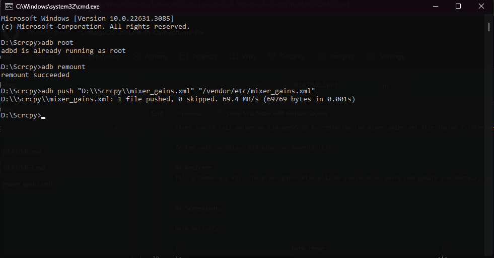

# LineageOS 20 Low in Call Volume Fix

### Developed by Wreak0Havoc.

## About

Fixes low in call volume on LineageOS 20 by replacing the mixer_gains.xml file inside /system/vendor/etc

Tested only on Galaxy S10 plus, on Android (13)

## Notice
This a temporary fix, the mixer gains file will be replaced on every rom update you install, so you must redo all this steps again. 

Take a full backup of the mixer_gains.xml file before installing

## Requirements

- Android 13
- Root enabled
- Usb debugging enabled

## Installation

**- Step 1:**   Download SDK Platform-Tools for Windows https://developer.android.com/tools/releases/platform-tools

**- Step 2:**   Extract the Platform-Tools.zip file

**- Step 3:**   Download the in.Call.Fix.By.KEMOZ.zip [Releases](https://github.com/Wreak0Havoc/LineageOS-20-Low-in-Call-Volume-Fix/releases/tag/in.Call.Fix.By.KEMOZ)

**- Step 4:**   Extract the mixer_paths.xml and open_a_terminal_here.bat inside the in.Call.Fix.By.KEMOZ.zip into Platform-Tools.zip folder

**- Step 5:**   Create a New folder Named "Backup"

**- Step 5:**   Open the open_a_terminal_here.bat 

**- Step 5:**   type inside the terminal: 

                adb root 
                
                adb remount
                
  Take Backup Before installing:              
  
  **Replace this line **"X:\\platform-tools\\Backup\\mixer_gains.xml"** With the Backup folder you created before**              
                
                adb pull "/vendor/etc/mixer_gains.xml" "X:\\platform-tools\\Backup\\mixer_gains.xml"
  
  **Replace this line **"X:\\platform-tools\\mixer_gains.xml"** With the exact location of the new **"mixer_gains.xml"** file inside the in.Call.Fix.By.KEMOZ.zip**
  
                adb push "X:\\platform-tools\\mixer_gains.xml" "/vendor/etc/mixer_gains.xml"
      
                
**Make sure to not pull the old mixer_gains.xml into the platform-tools or it will replace the new mixer gains file you extracted**
**instead Make sure to pull into the backup folder you created to avoid replacement**

**Done.**
## Screenshots

Main activity:

|                                  CMD                                   |
|:-----------------------------------------------------------------------------:
|  
